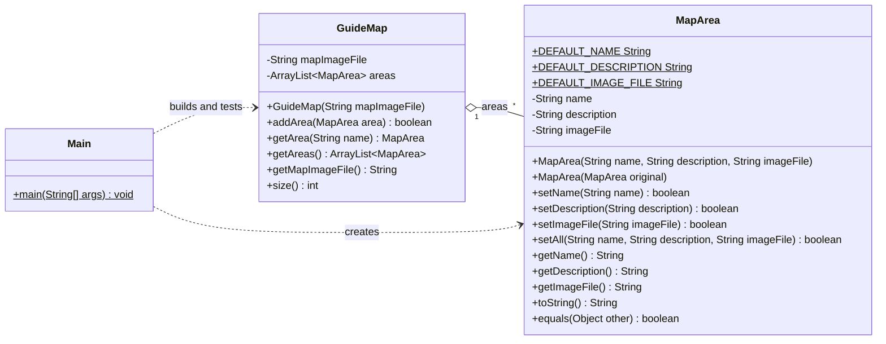

# CandeeLand Info Guide
 **In collaboration with Malik B. Working on a map information guide with pictures and descriptions**

# UML Class Diagram Test

```mermaid
classDiagram
    direction LR

    class MapArea {
        +DEFAULT_NAME String$
        +DEFAULT_DESCRIPTION String$
        +DEFAULT_IMAGE_FILE String$
        -String name
        -String description
        -String imageFile
        +MapArea(String name, String description, String imageFile)
        +MapArea(MapArea original)
        +setName(String name) boolean
        +setDescription(String description) boolean
        +setImageFile(String imageFile) boolean
        +setAll(String name, String description, String imageFile) boolean
        +getName() String
        +getDescription() String
        +getImageFile() String
        +toString() String
        +equals(Object other) boolean
    }

    class GuideMap {
        -String mapImageFile
        -ArrayList~MapArea~ areas
        +GuideMap(String mapImageFile)
        +addArea(MapArea area) boolean
        +getArea(String name) MapArea
        +getAreas() ArrayList~MapArea~
        +getMapImageFile() String
        +size() int
    }

    class Main {
        +main(String[] args) void$
    }

    GuideMap "1" o-- "*" MapArea : areas
    Main ..> GuideMap : builds and tests
    Main ..> MapArea : creates
```
